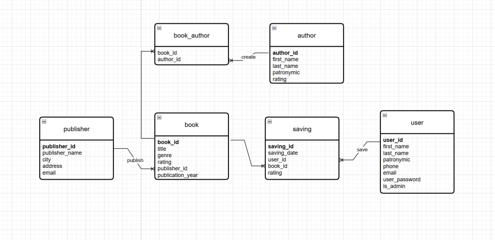

# Online library (Онлайн библиотека)

## Функциональные требования

У пользователя:
* Возможность просматривать все книги, издательства, авторов
* Возможность добавлять понравившиеся книги к себе на полку
* Возможность оценивать добавленные книги
* Поиск книг, издательств, авторов по их аттрибутам

У администратора:
* Возможность свободно просматривать данные (книги, пользователи и т.д.)
* Возможность удалять данные (с возможностью удалять базу данных полностью)
* Возможность добавлять новые данные

## ER-диаграмма базы данных

